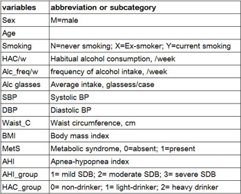

```{r setup, include=FALSE}
knitr::opts_chunk$set(echo = TRUE, fig.width=8, fig.height=8, tidy.opts=list(width.cutoff=60),tidy=TRUE)
```

## Habitual Alcohol Consumption and Metabolic Syndrome in Patients with Sleep Disordered Breathing

```{r include=FALSE}
suppressWarnings(suppressMessages(library(tidyverse)))
suppressWarnings(suppressMessages(library(broom)))
```

```{r read_data_from_csv, include=FALSE}
data_source <- "S1.csv"
OSA_HAC_Data <- read_csv(data_source)
```

```{r HLO - High Level Overview}
glimpse(OSA_HAC_Data)       # names, types of columns
```

## Summary and Definitions of few terms in the research papaer :
1) Investigate the relationship between HAC(Habitual Alcohol Consumption) and MetS(Metabolic Syndrome) and SDB(sleep-disordered breathing)
- compare the prevalence of MetS and sleep quality according to amount of HAC in male patients with SDB(Sleep Disordered Breathing)
- perform analysis to answer the below questions :
- Does alcohol consumption increase MetS?
- Does habitual alcohol consumption aggravate SDB and sleep quality?

2) Participants included 683 untreated SDB male patients.
3) Average (age: 54.4 $+/-$ 7.80 y, apnea-hypopnea index (AHI): 29.0 $+/-$ 21.53/h)
4) HAC was assessed as the no. of drinks consumed per week during past 12 months.
5) HAC groups --- no drinking, light drinking $<$ 13, heavy drinking $>=$ 13 drinks/week
6) MetS = Circumference $>$ 90cm for obesity AND 2 of the four issues (low HDL, hypertriglyceridemia, hypertension, hyperglycemia)
7) SDB = AHI $>=$ 5 $/$ h
8) Hypertension = SBP $>$ 130, DBP $>$ 85
9) Other terms are provided in a tabular format, at the end of the report.

## Exploratory Data Analysis

### Image of Graph 1 :

[Click Here - Graph 1](http://journals.plos.org/plosone/article?id=10.1371/journal.pone.0161276#pone-0161276-g001)

### Text of Graph 1 :

Proportion of sleep-disordered breathing (SDB) severity according to habitual alcohol consumption (HAC).
The distribution of severity of SDB was significantly different according to HAC amount ($X^2$ = 16.20, p = 0.003). The numbers of patients with severe SDB (apnea-hypopnea index greater than or equal to 30 per h) were the highest in heavy-drinkers. On the contrary, proportion of mild SDB was the greatest in non-drinkers.

### Text describing how Graph 1 was created :

1. First, we calculate the total number of observations across AHI_group column based on the HAC_group.
2. Next, we calculate the chi-square and p-value by using the same matrix.
3. Next, we calculate the proportions and create new columns in our new data frame 'sdb_hac_proportion' using the mutate function.
4. Next, we plot a barplot using the data in sdb_hac_proportion data frame. Here we make use of the various barplot parameters to replicate the barplot form the research paper. For example, displaying the text on the barplot, displaying legends correctly, setting the ylim.

### Code to reproduce Graph 1 :

```{r graph 1 chi-square test}
chi_matrix <- as.data.frame.matrix(table(OSA_HAC_Data$HAC_group, OSA_HAC_Data$AHI_group))

chi_value <- chisq.test(chi_matrix)
chi_sq_value <- chi_value$statistic
chi_sq_p_value <- chi_value$p.value
chi_value
```

```{r plot a barplot similar to graph 1}

sdb_hac_proportion <- as.data.frame.matrix(table(OSA_HAC_Data$HAC_group, OSA_HAC_Data$AHI_group))
sdb_hac_proportion["total"] <- sdb_hac_proportion$`1` + sdb_hac_proportion$`2` + sdb_hac_proportion$`3`
sdb_hac_proportion <- mutate(sdb_hac_proportion, 
       mild_sdb= (sdb_hac_proportion$`1`/ 
                    sdb_hac_proportion$total)*100,
       moderate_sdb = (sdb_hac_proportion$`2`/ 
                         sdb_hac_proportion$total)*100,
       severe_sdb = (sdb_hac_proportion$`3`/ 
                       sdb_hac_proportion$total)*100)
sdb_hac_proportion

sdb_bind_data <- rbind(sdb_hac_proportion$mild_sdb, sdb_hac_proportion$moderate_sdb,sdb_hac_proportion$severe_sdb)

sdb_hac_bp <- barplot(height = sdb_bind_data,
        beside = TRUE,
        main = "Proportion of sleep-disordered breathing (SDB) severity 
        according to habitual alcohol consumption (HAC).",
        cex.main=0.85,
        ylab = "%",
        ylim = c(0,50),
        names.arg = c("Non-drinkers", "light-drinkers", "heavy-drinkers"),
        legend.text = c("Mild SDB", "Moderate SDB", "Severe SDB"),
        args.legend = list(x="topright"),
        col=c("white","lightgrey","darkgrey"))

roundAt <- round(sdb_bind_data,1)
text(c(4,4.75,6,6.75),c(45,45,45,45),c("X^2=",round(chi_sq_value,2),"p=",round(chi_sq_p_value,4)))
text(sdb_hac_bp, 20,roundAt,cex=1,pos=3)
```

### Image of Table 1 :

[Click Here - Table 1](http://journals.plos.org/plosone/article?id=10.1371/journal.pone.0161276#pone-0161276-t001)

### Text of Table 1 :

Characteristics of subjects with sleep disordered breathing according to habitual alcohol consumption.

### Text describing how Table 1 was created :
1. First, we calculated the mean +/- sd for the Smoking parameter for all types of drinkers based on the HAC_group.
2. Similarly, we calculated the values for the rest of the table.
3. Initially, we calculated mean +/- sd values using the subset and select commands, the sd values were off by some numbers from the original sd values. However, Alison suggested us using dplyr group_by and summarize to calculate the values in a more efficient way. The sd values after the suggested changes, do match with the original values.
4. The R code chunks to create this particular table might be repititive, so please be patient. We do understand the report becomes too huge, but we thought to include it as a part of our Final report.

### Code to reproduce Table 1 :

                         Non-drinkers     Light-drinkers  Heavy-drinkers p
------------------------ -------------   ---------------- -------------- --------
Age                      56.48+/-8.19     54.16+/-7.95     53.41+/-7.11   0.001
Smoking                                                                   0.0337
Never smoking            75(52.08)        126(40.77)      84(36.52)      
Ex-smoker                43(29.86)        100(32.36)      78(33.91)
Current smoking          26(18.05)        83(26.86)       68(29.56)
Alcohol consumption/week 0                5.172+/-3.88    31.30+/-16.82   <0.001
Freq.Alcohol intake/week 0                1.437+/-1.009   3.294+/-1.47    <0.001
<1/month                                  6(1.94)         0
1/month                                   18(5.82)        0
2-4/month                                 217(70.22)      33(14.34)  
2-3/week                                  62(20.06)       131(56.95)
>=4week                                   6(1.94)         66(28.69)
Avg. intake per case     0                3.873+/-2.407   10.38+/-5.71    <0.001
<1 drink                                  13(4.20)        0
1-2 drinks                                96(31.06)       0
3-4 drinks                                90(29.12)       4(1.73)
5-6deinks                                 15(4.85)        6(2.60)
>=7drinks                                 68(29.56)       192(83.47)
SBP,mmHg                 118.6+/-11.2     119.4+/-14.38   121.3+/-14.67   0.184
DBP,mmHg                 75.44+/-9.90     76.53+/-9.70    79.24+/-10.12   <0.001
Anthropometric measures
Waist Circumference      90.55+/-9.09     89.95+/-7.18    91.7+/-7.92     0.038
Body mass index, kg/m^2  25.89+/-3.76     25.43+/-2.73    26.15+/-3.07    0.026


**HAC(Habitual Alcohol Consumption)**
**HAC_group = 0, 1 or 2, that is non-drinkers, light-drinkers and heavy drinkers**

- Note : As the data for Biochemical markers and Metabolic syndrome are unavilable, we could not replicate the results in our analysis. This is the last part of Table 1. This was discussed with both the instructors.

```{r creating data table 1, Age}
# Age
# Non-drinkers : 56.48 +/- 8.19
# Light-Drinkers : 54.16 +/- 7.95
# Heavy-Drinkers : 53.41 +/- 7.11

age_summary <- OSA_HAC_Data  %>% 
  group_by(HAC_group)  %>% 
  summarise(mean = mean(Age, na.rm = TRUE),
            sd = sd(Age, na.rm = TRUE))
age_summary
```

```{r creating data table 1 code - Non-drinkers, smoking}
# Non-drinkers
total_smokers_hac_0 <- subset(OSA_HAC_Data, select = Smoking, subset = HAC_group==0)
count(total_smokers_hac_0) #144

# Non-drinkers, Never Smoking
smoke_N_hac_0 <- subset(OSA_HAC_Data, select = Smoking, subset = (HAC_group==0 & Smoking=='N'))
count(smoke_N_hac_0) #75 - displayed in Table 1

proportion_N_hac_0 = (count(smoke_N_hac_0)/count(total_smokers_hac_0)) * 100 
proportion_N_hac_0 # 52.08 - displayed in Table 1

# Non-drinkers, Ex smoker
smoke_X_hac_0 <- subset(OSA_HAC_Data, select = Smoking, subset = (HAC_group==0 & Smoking=='X'))
count(smoke_X_hac_0) # 43 - displayed in Table 1
proportion_X_hac_0 = (count(smoke_X_hac_0)/count(total_smokers_hac_0)) * 100 
proportion_X_hac_0 # 29.86 - displayed in Table 1

# Non-drinkers, Current smoker
smoke_Y_hac_0 <- subset(OSA_HAC_Data, select = Smoking, subset = (HAC_group==0 & Smoking=='Y'))
count(smoke_Y_hac_0) # 26 - displayed in Table 1
proportion_Y_hac_0 = (count(smoke_Y_hac_0)/count(total_smokers_hac_0)) * 100 
proportion_Y_hac_0 # 18.05 - displayed in Table 1
```

```{r creating data table 1 code Light-drinkers, smoking}
# Light-drinkers
total_smokers_hac_1 <- subset(OSA_HAC_Data, select = Smoking, subset = HAC_group==1)
count(total_smokers_hac_1) #309

# Light-drinkers, Never smoking
smoke_N_hac_1 <- subset(OSA_HAC_Data, select = Smoking, subset = (HAC_group==1 & Smoking=='N'))
count(smoke_N_hac_1) #126 - displayed in Table 1

proportion_N_hac_1 = (count(smoke_N_hac_1)/count(total_smokers_hac_1)) * 100 
proportion_N_hac_1 # 40.77 - displayed in Table 1

# Light-drinkers, Ex smoker
smoke_X_hac_1 <- subset(OSA_HAC_Data, select = Smoking, subset = (HAC_group==1 & Smoking=='X'))
count(smoke_X_hac_1) # 100 - displayed in Table 1
proportion_X_hac_1 = (count(smoke_X_hac_1)/count(total_smokers_hac_1)) * 100 
proportion_X_hac_1 # 32.36 - displayed in Table 1

# Light-drinkers, Current smoker
smoke_Y_hac_1 <- subset(OSA_HAC_Data, select = Smoking, subset = (HAC_group==1 & Smoking=='Y'))
count(smoke_Y_hac_1) # 83 - displayed in Table 1
proportion_Y_hac_1 = (count(smoke_Y_hac_1)/count(total_smokers_hac_1)) * 100 
proportion_Y_hac_1 # 26.86 - displayed in Table 1
```

```{r creating data table 1 code Heavy-drinkers, smoking}
# Heavy-drinkers
total_smokers_hac_2 <- subset(OSA_HAC_Data, select = Smoking, subset = HAC_group==2)
count(total_smokers_hac_2) #230

# Heavy-drinkers, Never smoking
smoke_N_hac_2 <- subset(OSA_HAC_Data, select = Smoking, subset = (HAC_group==2 & Smoking=='N'))
count(smoke_N_hac_2) #84 - displayed in Table 1

proportion_N_hac_2 = (count(smoke_N_hac_2)/count(total_smokers_hac_2)) * 100 
proportion_N_hac_2 # 36.52 - displayed in Table 1

# Heavy-drinkers, Ex smoker
smoke_X_hac_2 <- subset(OSA_HAC_Data, select = Smoking, subset = (HAC_group==2 & Smoking=='X'))
count(smoke_X_hac_2) # 78 - displayed in Table 1
proportion_X_hac_2 = (count(smoke_X_hac_2)/count(total_smokers_hac_2)) * 100 
proportion_X_hac_2 # 33.91 - displayed in Table 1

# Heavy-drinkers, Current smoker
smoke_Y_hac_2 <- subset(OSA_HAC_Data, select = Smoking, subset = (HAC_group==2 & Smoking=='Y'))
count(smoke_Y_hac_2) # 68 - displayed in Table 1
proportion_Y_hac_2 = (count(smoke_Y_hac_2)/count(total_smokers_hac_2)) * 100 
proportion_Y_hac_2 # 29.56 - displayed in Table 1

```

```{r creating data table 1 alcohol consumption/week}
# alcohol consumption/week
# Non-drinkers : 0
# Light-Drinkers :  5.172 +/- 3.88
# Heavy-Drinkers : 31.29 +/- 16.82

alcohol_cons_summary <- OSA_HAC_Data  %>% 
  group_by(HAC_group)  %>% 
  summarise(mean = mean(`HAC/w`, na.rm = TRUE),
            sd = sd(`HAC/w`, na.rm = TRUE))
alcohol_cons_summary

```

```{r creating data table 1 Frequency of alcohol intake/week}
# Frequency of alcohol intake/week
# Non-drinkers : 0
# Light-Drinkers :  1.437 +/- 1.009
# Heavy-Drinkers : 3.294 +/- 1.47

alcohol_intake_summary <- OSA_HAC_Data  %>% 
  group_by(HAC_group)  %>% 
  summarise(mean = mean(`Alc_freq/w`, na.rm = TRUE),
            sd = sd(`Alc_freq/w`, na.rm = TRUE))
alcohol_intake_summary

```

```{r alocohol intake frequency per month}
total_hac_1 <- subset(OSA_HAC_Data, select = `Alc_freq/w`, subset = HAC_group==1)
count(total_hac_1) #309

total_hac_2 <- subset(OSA_HAC_Data, select = `Alc_freq/w`, subset = HAC_group==2)
count(total_hac_2) #309

# The range for Alc_freq/w in below code chunks is estimated by us as they were not provided in the research paper.
# Here, we consider 'a week' as (1/4th) part of a 30-day month. So, in few cases our values differ from the original values.

# <1/month-------------------------------------------------------------
less_1_month<-subset(OSA_HAC_Data, select = `Alc_freq/w`, `Alc_freq/w`  >0 & `Alc_freq/w`  < 0.25 & HAC_group==1 )
count(less_1_month) #6

proportion_less_1_month_hac_1 = (count(less_1_month)/count(total_hac_1)) * 100 
proportion_less_1_month_hac_1 # 1.941748


#1/month-----------------------------------------------------------------
one_per_month<-subset(OSA_HAC_Data, select = `Alc_freq/w`, `Alc_freq/w`  >=0.25 & `Alc_freq/w`  < 0.49 & HAC_group==1 )
count(one_per_month) #18

proportion_one_per_month_hac_1 = (count(one_per_month)/count(total_hac_1)) * 100 
proportion_one_per_month_hac_1     # 5.825243


# 2-4/month-----------------------------------------------------------
#hac=1
two_four_month1<-subset(OSA_HAC_Data, select = `Alc_freq/w`, `Alc_freq/w`  >=0.50 &  `Alc_freq/w`  <2 & HAC_group==1 )
count(two_four_month1) #217

proportion_two_four_per_month_hac_1 = (count(two_four_month1)/count(total_hac_1)) * 100 
proportion_two_four_per_month_hac_1  #70.22654

#hac=2
two_four_month2<-subset(OSA_HAC_Data, select = `Alc_freq/w`, `Alc_freq/w`  >=0.50 &  `Alc_freq/w`  <2 & HAC_group==2 ) #33
count(two_four_month2)

proportion_two_four_per_month_hac_2 = (count(two_four_month2)/count(total_hac_2)) * 100 
proportion_two_four_per_month_hac_2  #14.34783

# 2-3/week---------------------------------------------
# hac = 1
two_three_week1<-subset(OSA_HAC_Data, select = `Alc_freq/w`, `Alc_freq/w`  >=2 &  `Alc_freq/w`  <4  & HAC_group==1)
count(two_three_week1) #62
proportion_two_three_week1_hac_1 = (count(two_three_week1)/count(total_hac_1)) * 100 
proportion_two_three_week1_hac_1 #20.06472
#hac = 2
two_three_week2<-subset(OSA_HAC_Data, select = `Alc_freq/w`, `Alc_freq/w`  >=2 &  `Alc_freq/w`  <4  & HAC_group==2)
count(two_three_week2) #131

proportion_two_three_week1_hac_2 = (count(two_three_week2)/count(total_hac_2)) * 100 
proportion_two_three_week1_hac_2 #56.95652

# >=4/week--------------------------------------------------------
# hac = 1
two_three_week1<-subset(OSA_HAC_Data, select = `Alc_freq/w`, `Alc_freq/w`  >=4 &   HAC_group==1)
count(two_three_week1) #6

proportion_two_three_week1_hac_1 = (count(two_three_week1)/count(total_hac_1)) * 100 
proportion_two_three_week1_hac_1#1.941748
# hac = 2
two_three_week2<-subset(OSA_HAC_Data, select = `Alc_freq/w`, `Alc_freq/w`  >=4 &   HAC_group==2)
count(two_three_week2) #66
proportion_two_three_week1_hac_2 = (count(two_three_week2)/count(total_hac_2)) * 100 
proportion_two_three_week1_hac_2#28.69565

```

```{r average intake per case}
# average intake per case
# Non-drinkers : 0
# Light-Drinkers : 3.873528 +/- 2.407464
# Heavy-Drinkers : 10.377348 +/- 5.716741

avg_intake_per_case <- OSA_HAC_Data  %>% 
  group_by(HAC_group)  %>% 
  summarise(mean = mean(`Alc glasses`, na.rm = TRUE),
            sd = sd(`Alc glasses`, na.rm = TRUE))
avg_intake_per_case

# The range for 'Alc glasses' in below code chunks is estimated by us as they were not provided in the research paper.
# So, in few cases our values differ from the original values.

#----------<1 drink for hac_group = 1
count(subset(OSA_HAC_Data, select = `Alc glasses`, `Alc glasses` <1 & HAC_group==1)) #13
proportion_drink_less_hac_1 = (count(subset(OSA_HAC_Data, select = `Alc glasses`, `Alc glasses` <1 & HAC_group==1))/count(total_hac_1)) * 100 
proportion_drink_less_hac_1#4.20712

#----------1-2 drink for hac_group = 1
count(subset(OSA_HAC_Data, select = `Alc glasses`, `Alc glasses` >=1 & `Alc glasses` <3 & HAC_group==1))# 96
count(subset(OSA_HAC_Data, select = `Alc glasses`, `Alc glasses` >=1 & `Alc glasses` <3 & HAC_group==1))/count(total_hac_1) * 100 
#31.06796

#----------3-4 drink for hac_group = 1 and 2
count(subset(OSA_HAC_Data, select = `Alc glasses`, `Alc glasses` >=3 & `Alc glasses` <=4 & HAC_group==1))#90
count(subset(OSA_HAC_Data, select = `Alc glasses`, `Alc glasses` >=3 & `Alc glasses` <=4 & HAC_group==1))/count(total_hac_1) * 100#29.12621

count(subset(OSA_HAC_Data, select = `Alc glasses`, `Alc glasses` >=3 & `Alc glasses` <=4 & HAC_group==2))#4
count(subset(OSA_HAC_Data, select = `Alc glasses`, `Alc glasses` >=3 & `Alc glasses` <=4 & HAC_group==2))/count(total_hac_2) * 100#1.73913

#----------5-6 drink for hac_group = 1 and 2
count(subset(OSA_HAC_Data, select = `Alc glasses`, `Alc glasses` >=5 & `Alc glasses` <=6 & HAC_group==1))#15
count(subset(OSA_HAC_Data, select = `Alc glasses`, `Alc glasses` >=5 & `Alc glasses` <=6 & HAC_group==1))/count(total_hac_1) * 100#4.854369

count(subset(OSA_HAC_Data, select = `Alc glasses`, `Alc glasses` >=5 & `Alc glasses` <=6 & HAC_group==2))#6
count(subset(OSA_HAC_Data, select = `Alc glasses`, `Alc glasses` >=5 & `Alc glasses` <=6 & HAC_group==2))/count(total_hac_2) * 100#2.608696


#---------->=7 drink for hac_group = 1 and 2
count(subset(OSA_HAC_Data, select = `Alc glasses`, `Alc glasses` >=7  & HAC_group==1))#68
count(subset(OSA_HAC_Data, select = `Alc glasses`, `Alc glasses` >=7  & HAC_group==1))/count(total_hac_2) * 100#29.56522

count(subset(OSA_HAC_Data, select = `Alc glasses`, `Alc glasses` >=7 & HAC_group==2))#192
count(subset(OSA_HAC_Data, select = `Alc glasses`, `Alc glasses` >=7 & HAC_group==2))/count(total_hac_2) * 100#83.47826

```

```{r creating data table 1, SBP, mmHg}
# SBP, mmHg 
# Non-drinkers : 118.6 +/- 15.53
# Light-Drinkers : 119.4 +/- 14.38
# Heavy-Drinkers : 121.3 +/- 14.67

sbp_summary <- OSA_HAC_Data  %>% 
  group_by(HAC_group)  %>% 
  summarise(mean = mean(SBP, na.rm = TRUE),
            sd = sd(SBP, na.rm = TRUE))
sbp_summary
```

```{r creating data table 1, DBP}
# DBP, mmHg 
# Non-drinkers : 75.44 +/- 9.90
# Light-Drinkers : 76.53 +/- 9.70
# Heavy-Drinkers : 79.24 +/- 10.12

dbp_summary <- OSA_HAC_Data  %>% 
  group_by(HAC_group)  %>% 
  summarise(mean = mean(DBP, na.rm = TRUE),
            sd = sd(DBP, na.rm = TRUE))
dbp_summary
```

```{r creating data table 1 Anthropometric measures}
# Anthropometric measures
# waist circumference, cm
# non-drinkers : 90.55 +/- 9.09
# light-drinkers : 89.95 +/- 7.18 
# heavy-drinkers : 91.7 +/- 7.92

waist_hac_summary <- OSA_HAC_Data  %>% 
  group_by(HAC_group)  %>% 
  summarise(mean = mean(Waist_C, na.rm = TRUE),
            sd = sd(Waist_C, na.rm = TRUE))
waist_hac_summary

# BMI, kg/m^2
# non-drinkers : 25.89 +/- 3.76
# light-drinkers : 25.43 +/- 2.73 
# heavy-drinkers : 26.15 +/- 3.07

bmi_hac_summary <- OSA_HAC_Data  %>% 
  group_by(HAC_group)  %>% 
  summarise(mean = mean(BMI, na.rm = TRUE),
            sd = sd(BMI, na.rm = TRUE))
bmi_hac_summary
```

----------------------------------------------------------------------------------------

### Calculating the last column, that is the p-value in Table 1
- We did not cover this part during our EDA analysis report, and so we calculate the last column separately for each case in our Final report.
- As suggested in the Statistical Analyses part of the paper :
- The alpha level for statistical significance was set at p <0.05. Descriptive statistics of mean±SD and number (percentage) are summarized in Table 1. Normally distributed continuous data were analyzed using one-way analysis of variance (ANOVA). Categorical variables were analyzed using the Chi-square test.
- [Click Here - Statistical Analyses](http://journals.plos.org/plosone/article?id=10.1371/journal.pone.0161276#sec010)

```{r creating data table 1 calculating the last column, that is the p-value, warning = FALSE}

# Age*, years , p = 0.001 (expected)
age_lm_data <- subset(OSA_HAC_Data, select = c(Age,HAC_group))
age_lm_data$HAC_group <- factor(age_lm_data$HAC_group)
age_lm_out <- lm(Age ~ HAC_group, data = age_lm_data)
anova(age_lm_out) # 0.0007724 ~ 0.001

# Never-Smoking, p = 0.034 (expected)
chi_Smoking_table <- subset(OSA_HAC_Data, select = c(Smoking,HAC_group))
chi_Smoking_matrix <- as.data.frame.matrix(table(chi_Smoking_table$Smoking, chi_Smoking_table$HAC_group))
chisq.test(chi_Smoking_matrix)  # 0.03374

#Alcohol consumption/week, p = <0.001 (expected)
alc_per_week_lm_data <- subset(OSA_HAC_Data, select = c(`HAC/w`,HAC_group))
alc_per_week_lm_data$HAC_group <- factor(alc_per_week_lm_data$HAC_group)
alc_per_week_lm_out <- lm(`HAC/w` ~ HAC_group, data = alc_per_week_lm_data)
anova(alc_per_week_lm_out) # < 2.2e-16

# Frequency of alcohol intake per week, p = <0.001 (expected)
alc_freq_table <- subset(OSA_HAC_Data, select = c(`Alc_freq/w`,HAC_group))
alc_freq_table <- alc_freq_table %>% mutate("Freq" = `Alc_freq/w`)
alc_freq_table$FreqCat <- cut(alc_freq_table$Freq, c(-1,0.24,0.49,1.99,3.99,7))
chi_alc_freq_matrix <- as.data.frame.matrix(table(alc_freq_table$FreqCat, alc_freq_table$HAC_group))
chisq.test(chi_alc_freq_matrix) # < 2.2e-16

# Avg intake case per week, <1/drink , p = <0.001 (expected)
alc_intake_table <- subset(OSA_HAC_Data, select = c(`Alc glasses`,HAC_group))
alc_intake_table <- alc_intake_table %>% mutate("Freq" = `Alc glasses`)
alc_intake_table$FreqCat <- cut(alc_intake_table$Freq, c(-1,0.99,2.99,4.99,6,100))
chi_alc_intake_matrix <- as.data.frame.matrix(table(alc_intake_table$FreqCat, alc_intake_table$HAC_group))
chisq.test(chi_alc_intake_matrix) # < 2.2e-16

# SBP mmHg, p = 0.185 (expected)
sbp_dbp_lm_data <- subset(OSA_HAC_Data, select = c(SBP,DBP,HAC_group))
sbp_dbp_lm_data$HAC_group <- factor(sbp_dbp_lm_data$HAC_group)

sbp_anova_data <- lm(SBP ~ HAC_group,data = sbp_dbp_lm_data)
anova(sbp_anova_data)  # 0.1847

# DBP mmHg, p < 0.001 (expected)
dbp_anova_data <- lm(DBP ~ HAC_group,data = sbp_dbp_lm_data)
anova(dbp_anova_data)  # 0.0004058


# Anthropometric measures
waist_bmi_lm_data <- subset(OSA_HAC_Data, select = c(Waist_C, BMI, HAC_group))
waist_bmi_lm_data$HAC_group <- factor(waist_bmi_lm_data$HAC_group)

# waist circumference, cm, p = 0.038 (expected)
waist_anova_data <- lm(Waist_C ~ HAC_group,data = waist_bmi_lm_data)
anova(waist_anova_data) # 0.03813

# Body Mass Index, p = 0.026
bmi_anova_data <- lm(BMI ~ HAC_group,data = waist_bmi_lm_data)
anova(bmi_anova_data) # 0.02637


```

----------------------------------------------------------------------------------------

## Final report : Replication of analyses/results in the paper that are based on the general linear model (t-tests, linear regression, Analysis of Variance) 

### Odds ratio (95% Confidence Intervals) for metabolic syndrome according to habitual alcohol consumption.

```{r odds ratio table 3, message=FALSE,warning=FALSE}
# create a new data frame by selecting the required columns MetS, HAC_group, Age, AHI and BMI. 
# make sure the columns are factor variables before we perform glm
data_table3 <- subset(OSA_HAC_Data, select = c(MetS,HAC_group,Age,AHI,AHI_group,BMI))
data_table3$MetS <- factor(data_table3$MetS)
data_table3$HAC_group <- factor(data_table3$HAC_group)
glimpse(data_table3)


##**********************Start glm (Unadjusted)********************************
# Fit a logistic regression model to the data_table3 data set, using HAC_group as predictor.
metS_glm_out <- glm(MetS ~ HAC_group, data = data_table3, family = "binomial")
summary(metS_glm_out)

# broom function to breakdown the output.
tidy(metS_glm_out)

##**********************Start Odds ratio (Unadjusted)********************************
## odds ratios only
round(exp(coef(metS_glm_out)), 2)

## odds ratios and 95% CI
round(exp(cbind(OR=coef(metS_glm_out), confint(metS_glm_out))), 2)

# broom one line output
tidy(metS_glm_out, exponentiate = TRUE, conf.int = TRUE)

#So, we can say that :
# The odds of being a light drinker(HAC_group1) and having metabolic syndrome is 0.90
# The odds of being a heavy drinker(HAC_group2) and having metabolic syndrome is 1.50
# Unadjusted : The results revealed that heavy drinkers were more likely to have MetS than non-drinkers [odds ratio (OR) = 1.50 (0.98 – 2.31)] 
##**********************End Odds ratio (Unadjusted)********************************


##**********************Start glm (Adjusted for Age)********************************
# Fit a logistic regression model to the data_table3 data set, using HAC_group + Age as predictors.
metS_age_glm_out <- glm(MetS ~ HAC_group + Age, data = data_table3, family = "binomial")
summary(metS_age_glm_out)

##**********************Start Odds ratio (Adjusted for Age)*************************
## odds ratios only
round(exp(coef(metS_age_glm_out)), 2)

## odds ratios and 95% CI
round(exp(cbind(OR=coef(metS_age_glm_out), confint(metS_age_glm_out))), 2)

#So, we can say that :
# The odds of being a light drinker(HAC_group1) and having metabolic syndrome is 0.91
# The odds of being a heavy drinker(HAC_group2) and having metabolic syndrome is 1.52
# Adjusted(Age) : The results revealed that heavy drinkers were more likely to have MetS than non-drinkers [odds ratio (OR) = 1.52 (0.98 – 2.35)] 
##**********************End Odds ratio (Adjusted for Age)*****************************


##**********************Start glm (Adjusted for Age and AHI)****************************
# Fit a logistic regression model to the data_table3 data set, using HAC_group + Age + AHI as predictors.
metS_age_ahi_glm_out <- glm(MetS ~ HAC_group + Age + AHI, data = data_table3, family = "binomial")
summary(metS_age_ahi_glm_out)

##**********************Start Odds ratio (Adjusted for Age and AHI)********************
## odds ratios only
round(exp(coef(metS_age_ahi_glm_out)), 2)

## odds ratios and 95% CI
round(exp(cbind(OR=coef(metS_age_ahi_glm_out), confint(metS_age_ahi_glm_out))), 2)

#So, we can say that :
# The odds of being a light drinker(HAC_group1) and having metabolic syndrome is 0.87
# The odds of being a heavy drinker(HAC_group2) and having metabolic syndrome is 1.38
# Adjusted(Age) : The results revealed that heavy drinkers were more likely to have MetS than non-drinkers [odds ratio (OR) = 1.38 (0.89 – 2.16)] 
##**********************End Odds ratio (Adjusted for Age and AHI)**********************


##**********************Start glm (Adjusted for Age, AHI and BMI)**********************
# Fit a logistic regression model to the data_table3 data set, using HAC_group + Age + AHI + BMI as predictors.
metS_age_ahi_bmi_glm_out <- glm(MetS ~ HAC_group + Age + AHI + BMI, data = data_table3, family = "binomial")
summary(metS_age_ahi_bmi_glm_out)

##**********************Start Odds ratio (Adjusted for Age, AHI and BMI)***************
## odds ratios only
round(exp(coef(metS_age_ahi_bmi_glm_out)), 2)

## odds ratios and 95% CI
round(exp(cbind(OR=coef(metS_age_ahi_bmi_glm_out), confint(metS_age_ahi_bmi_glm_out))), 2)

#So, we can say that :
# The odds of being a light drinker(HAC_group1) and having metabolic syndrome is 1.13
# The odds of being a heavy drinker(HAC_group2) and having metabolic syndrome is 1.71
# Adjusted(Age) : The results revealed that heavy drinkers were more likely to have MetS than non-drinkers [odds ratio (OR) = 1.71 (1.01 – 2.89)] 

##**********************End Odds ratio (Adjusted for Age, AHI and BMI)*****************

```

### Table 3. Odds ratio (95% Confidence Intervals) for metabolic syndrome according to habitual alcohol consumption.

|              | Unadjusted       |Adjusted for Age |Adjusted for Age and AHI | Adjusted for Age, AHI and BMI|
|:------------:|:----------------:|:---------------:|:-----------------------:|:----------------------------:|
|Non-drinkers  |1.0(reference)    |1.0(reference)   |1.0(reference)           | 1.0(reference)               |
|Light-drinkers|0.90(0.59 - 1.37) |0.91(0.60 - 1.39)|0.87(0.57 - 1.34)        | 1.13(0.68 - 1.89)            |
|Heavy-drinkers|1.50(0.97 - 2.31) |1.52(0.98 - 2.35)|1.38(0.89 - 2.16)        | 1.70(1.01 - 2.89)            |
|AHI: apnea-hypopnea index| BMI : body-mass index | | | |


----------------------------------------------------------------------------------------

### Odds ratio (95% Confidence Intervals) for metabolic syndrome according to habitual alcohol consumption.

```{r odds ratio table 4, message=FALSE,warning=FALSE}
#-----------------------------------------------------------------
# create a new data frame by selecting the required columns AHI,MetS, HAC_group, Age, AHI_group and BMI. 
# make sure the columns are factor variables before we perform glm
data_table4 <- subset(OSA_HAC_Data, select = c(MetS,HAC_group,Age,AHI,AHI_group,BMI))
data_table4$HAC_group <- factor(data_table4$HAC_group)
glimpse(data_table4)

# Fit a logistic regression model to the data_table4 data set, using HAC_group as predictor.

data_table4 <- data_table4 %>% mutate ("SevereAHI"= ifelse(AHI>30,1,0))
data_table4$SevereAHI <- factor(data_table4$SevereAHI)


##**********************Start glm (Unadjusted)********************************
# Fit a logistic regression model to the data_table4 data set, using HAC_group as predictor.
AHI_glm_out <- glm(SevereAHI ~ HAC_group, data = data_table4, family = "binomial")
summary(AHI_glm_out)


# broom function to breakdown the output.
tidy(AHI_glm_out)

##**********************Start Odds ratio (Unadjusted)********************************
## odds ratios only
round(exp(coef(AHI_glm_out)), 2)

## odds ratios and 95% CI
round(exp(cbind(OR=coef(AHI_glm_out), confint(AHI_glm_out))), 2)

# broom one line output
tidy(AHI_glm_out, exponentiate = TRUE, conf.int = TRUE)

#So, we can say that :
# The odds of being a light drinker(HAC_group1) and having metabolic syndrome is 1.78
# The odds of being a heavy drinker(HAC_group2) and having metabolic syndrome is 2.07
# Unadjusted : The results revealed that heavy drinkers were more likely to have AHI than non-drinkers [odds ratio (OR) = 2.07 (1.32 – 3.31)] 
##**********************End Odds ratio (Unadjusted)********************************


##**********************Start glm (Adjusted for Age)********************************
# Fit a logistic regression model to the data_table4 data set, using HAC_group + Age as predictors.

AHI_age_glm_out <- glm(SevereAHI ~ HAC_group + Age, data = data_table4, family = "binomial")
summary(AHI_age_glm_out)

##**********************Start Odds ratio (Adjusted for Age)*************************
## odds ratios only
round(exp(coef(AHI_age_glm_out)), 2)

## odds ratios and 95% CI
round(exp(cbind(OR=coef(AHI_age_glm_out), confint(AHI_age_glm_out))), 2)

#So, we can say that :
# The odds of being a light drinker(HAC_group1) and having metabolic syndrome is 1.71
# The odds of being a heavy drinker(HAC_group2) and having metabolic syndrome is 1.97
# Adjusted(Age) : The results revealed that heavy drinkers were more likely to have AHI than non-drinkers [odds ratio (OR) = 1.97 (1.24 – 3.15)] 
##**********************End Odds ratio (Adjusted for Age)*****************************


##**********************Start glm (Adjusted for Age and BMI)****************************
# Fit a logistic regression model to the data_table4 data set, using HAC_group + Age + BMI as predictors.
AHI_age_mets_glm_out <- glm(SevereAHI ~ HAC_group + Age + BMI, data = data_table4, family = "binomial")
summary(AHI_age_mets_glm_out)
#HAC_group + Age +BMI

##**********************Start Odds ratio (Adjusted for Age and BMI)********************
## odds ratios only
round(exp(coef(AHI_age_mets_glm_out)), 2)

## odds ratios and 95% CI
round(exp(cbind(OR=coef(AHI_age_mets_glm_out), confint(AHI_age_mets_glm_out))), 2)

#So, we can say that :
# The odds of being a light drinker(HAC_group1) and having metabolic syndrome is 2.06
# The odds of being a heavy drinker(HAC_group2) and having metabolic syndrome is 2.11
# Adjusted(Age) : The results revealed that heavy drinkers were more likely to have AHI than non-drinkers [odds ratio (OR) = 2.11 (1.30 – 3.47)] 
##**********************End Odds ratio (Adjusted for Age and BMI)**********************

```

### Table 4. Odds ratio (95% Confidence Intervals) for Severe apnea-hypopnea index according to habitual alcohol consumption.


|                 | Unadjusted        | Adjusted for Age | Adjusted for Age and BMI | 
|:---------------:|:-----------------:|:----------------:|:------------------------:|
| Non-drinkers    | 1.0(reference)    | 1.0(reference)   | 1.0(reference)           | 
| Light-drinkers  | 1.78(1.15 - 2.79) | 1.71(1.10 - 2.69)| 2.06(1.30 - 3.34)        | 
| Heavy-drinkers  | 2.07(1.32 - 3.31) | 1.97(1.24 - 3.15)| 2.11(1.30 - 3.47)        | 
| AHI: apnea-hypopnea index| BMI : body-mass index | | | 


----------------------------------------------------------------------------------------

## Produce 'Results' section from research paper (such as F-statistic, p-value) :
[**Click Here - Results Section**](http://journals.plos.org/plosone/article?id=10.1371/journal.pone.0161276#sec010)

```{r results data}
result_data_1 <- subset(OSA_HAC_Data, select = c(MetS,HAC_group,Age,BMI,Waist_C))
result_data_1$MetS <- factor(result_data_1$MetS)
result_data_1$HAC_group <- factor(result_data_1$HAC_group)
glimpse(result_data_1)

# Heavy drinkers consumed a weekly average of 30.7±17.29 drinks. Heavy drinkers were also the youngest (F = 7.24, p = 0.001) 
hdrinkers_youngest_lm_out <- lm(Age ~ HAC_group, data = result_data_1)
summary(hdrinkers_youngest_lm_out)

# Heavy drinkers also had the highest BMI (F = 3.65, p = 0.026) 
hdrinkers_BMI_lm_out <- lm(BMI ~ HAC_group, data = result_data_1)
summary(hdrinkers_BMI_lm_out)

# Heavy drinkers also had the largest waist circumference (F = 3.28, p = 0.038)
hdrinkers_WC_lm_out <- lm(Waist_C ~ HAC_group, data = result_data_1)
summary(hdrinkers_WC_lm_out)

# The prevalence of MetS in participants with SDB was 36.9% and was high in heavy drinkers (44.3%, X2 = 8.51, p = 0.014). 

# First, lets calculate the prevalence of MetS in participants with SDB, which is 36.9%
chi_MetS_SDB_table <- subset(OSA_HAC_Data, select = c(MetS,AHI_group))
chi_MetS_SDB_matrix <- as.data.frame.matrix(table(chi_MetS_SDB_table$MetS, chi_MetS_SDB_table$AHI_group))
colnames(chi_MetS_SDB_matrix)<- c("mild_SDB","moderate_SDB","severe_SDB")
rownames(chi_MetS_SDB_matrix)<- c("MetS_NO", "MetS_YES")
chi_MetS_SDB_matrix$Total <- rowSums(chi_MetS_SDB_matrix)
chi_MetS_SDB_matrix
prevalence_MetS_SDB_result <- chi_MetS_SDB_matrix['MetS_YES','Total']/
  (chi_MetS_SDB_matrix['MetS_NO','Total']+chi_MetS_SDB_matrix['MetS_YES','Total']) * 100
prevalence_MetS_SDB_result

# Now, lets calculate the second part, that is, prevalence of MetS was high in heavy drinkers (44.3%, X2 = 8.51, p = 0.014). 
chi_MetS_HD_table <- subset(OSA_HAC_Data, select = c(MetS,HAC_group))
chi_MetS_HD_matrix <- as.data.frame.matrix(table(chi_MetS_HD_table$MetS, chi_MetS_HD_table$HAC_group))
colnames(chi_MetS_HD_matrix)<- c("non-drinkers","light-drinkers","heavy-drinkers")
rownames(chi_MetS_HD_matrix)<- c("MetS_NO", "MetS_YES")
chi_MetS_HD_matrix

# prevalence of MetS was high in heavy drinkers ---- 44.3%,
prevalence_MetS_HD_result <- chi_MetS_HD_matrix['MetS_YES','heavy-drinkers']/(chi_MetS_HD_matrix['MetS_NO','heavy-drinkers']+chi_MetS_HD_matrix['MetS_YES','heavy-drinkers']) * 100
prevalence_MetS_HD_result

# prevalence of MetS was high in heavy drinkers (X2 = 8.51, p = 0.014). 
chi_MetS_HD_value <- chisq.test(chi_MetS_HD_matrix)
chi_MetS_HD_value

```

----------------------------------------------------------------------------------------

## Final report - 3 extension pieces

**An additional plot**

- Through the boxplot and violin plots below, we can say that the severity of SDB was the greatest in heavy drinkers than in those with non-drinkers or light-drinkers.

```{r final report additional plot 1 , message=FALSE, warning=FALSE}
ahi_hac_data <- subset(OSA_HAC_Data, select = c(AHI, HAC_group))

ahi_hac_data$HAC_group <- factor(ahi_hac_data$HAC_group)

ggplot(ahi_hac_data, aes(y=AHI, x=HAC_group,fill=HAC_group)) + 
  geom_boxplot() +
  ggtitle("AHI vs Habitual Alcohol Consumption") +
  labs(x="Habitual Alcohol Consumption",y="Apnea-Hypopnea Index") +
  scale_x_discrete(labels=c("Non-drinkers", "Light-Drinkers", "Heavy-Drinkers")) +
  scale_y_continuous(limits=c(0,50)) +
  scale_fill_discrete(name="Habitual Alcohol Consumption",
        labels=c("Non-drinkers","Light-Drinkers", "Heavy-Drinkers")) +
  theme(legend.position="bottom")
```
```{r final report additional plot 2}
ggplot(ahi_hac_data, aes(y=AHI, x=HAC_group,fill=HAC_group)) + 
  geom_violin() +
  ggtitle("AHI vs Habitual Alcohol Consumption") +
  labs(x="Habitual Alcohol Consumption",y="Apnea-Hypopnea Index") +
  scale_x_discrete(labels=c("Non-drinkers", "Light-Drinkers", "Heavy-Drinkers")) +
  scale_y_continuous(limits=c(0,50)) +
  scale_fill_discrete(name="Habitual Alcohol Consumption",
        labels=c("Non-drinkers","Light-Drinkers", "Heavy-Drinkers")) +
  theme(legend.position="bottom")

```

----------------------------------------------------------------------------------------

**An additional analysis using a method we have covered this quarter in class that answers a new and different question or hypothesis you have come up with yourself**

- After adjusting for age and BMI, we check if light-drinkers and heavy-drinkers are more habitual to smoking. 
- So, to examine the association between HAC and Smoking after adjusting for possible confounders (age and BMI), we performed multiple logistic regression analyses.
- The results of the logistic regression analysis are reported as adjusted odds ratio (OR) with 95% confidence interval (CI).
- **Analyses result :** After adjusting for age and BMI, we found that light drinkers had a 1.88 times higher chances of being more habituated to smoking and heavy drinkers had a 2.14 times higher chances compared with non-drinkers. 

```{r final report odds ratio extra analysis for smoking, message=FALSE, warning=FALSE}
smoking_glm_table <- subset(OSA_HAC_Data, select = c(Smoking,HAC_group,Age, BMI))

# Filter the Ex-smoker values, now smoking column consists of participants 
# who are either non-smokers or current smokers. This is becasue we require
# the smoking column to be binomial to perform the regression analyses.

smoking_glm_table <- filter(smoking_glm_table, Smoking=='N' | Smoking=='Y')
smoking_glm_table$Smoking <- ifelse(smoking_glm_table$Smoking=='N',0,1)
smoking_glm_table$Smoking <- factor(smoking_glm_table$Smoking)
smoking_glm_table$HAC_group <- factor(smoking_glm_table$HAC_group)
glimpse(smoking_glm_table)

##**********************Start glm (Adjusted for Age and BMI)****************************
# Fit a logistic regression model to the smoking_glm_table data set, using HAC_group + Age + BMI as predictors.

smoking_glm_out <- glm(Smoking ~ HAC_group + Age + BMI, data=smoking_glm_table, family = "binomial")
summary(smoking_glm_out)

## odds ratios only
round(exp(coef(smoking_glm_out)), 2)

## odds ratios and 95% CI
round(exp(cbind(OR=coef(smoking_glm_out), confint(smoking_glm_out))), 2)

#So, we can say that :
# The odds of being a light drinker(HAC_group1) and habitual to smoking is 1.88
# The odds of being a heavy drinker(HAC_group2) and habitual to smoking is 2.14
# Adjusted(Age,BMI) : The results revealed that heavy drinkers were more likely habitual to smoking than non-drinkers [odds ratio (OR) = 2.14 (1.24 – 3.79)] 

# After adjusting for age and BMI, heavy drinkers [OR = 2.14(95% CI = 1.24–3.79)] and light drinkers [OR = 1.88 (95% CI = 1.11–3.26)] were more likely habitual to smoking than were the non-drinkers.
```

### Table 5 : Odds ratio (95% Confidence Intervals) for Smoking according to habitual alcohol consumption.


|                 | Adjusted for Age and BMI | 
|:---------------:|:------------------------:|
| Non-drinkers    | 1.0(reference)           | 
| Light-drinkers  | 1.88 (1.11 - 3.26)       | 
| Heavy-drinkers  | 2.14 (1.24 - 3.79)       | 


----------------------------------------------------------------------------------------

**An additional analysis using resampling based methods (bootstrapping or permutation tests) (again, this will come later; note that this does not have to be a new question or hypothesis- you can simply be testing the same hypothesis already tested in the paper using non-resampling based methods)**

- We perform resampling methods to one of our previous analyses.
- Analyses : The prevalence of MetS in participants with SDB was 36.9% and was high in heavy drinkers (44.3%, X2 = 8.51, p = 0.014). 
- So, we perform resampling based permutation testing to compute the p-value(prevalence of MetS was high in heavy drinkers (X2 = 8.51, p = 0.014)).
- So, the p-value of 0.014 tells us that the high prevalence of MetS in heavy drinkers is not due to chance.

```{r perform permutation test for already tested hypotheses}

# prevalence of MetS was high in heavy drinkers (X2 = 8.51, p = 0.014).

# Earlier analysis
# chi_MetS_HD_table <- subset(OSA_HAC_Data, select = c(MetS,HAC_group))
# chi_MetS_HD_table
# chi_MetS_HD_matrix <- as.data.frame.matrix(table(chi_MetS_HD_table$MetS, chi_MetS_HD_table$HAC_group))
# colnames(chi_MetS_HD_matrix)<- c("non-drinkers","light-drinkers","heavy-drinkers")
# rownames(chi_MetS_HD_matrix)<- c("MetS_NO", "MetS_YES")
# chi_MetS_HD_matrix

# chisq.test(chi_MetS_HD_matrix)
# Pearson's Chi-squared test
# data:  chi_MetS_HD_matrix
# X-squared = 8.5055, df = 2, p-value = 0.01423


# We perform resampling method (permutation test) to prove the same hypotheses that prevalence of MetS was high in heavy drinkers (X2 = 8.51, p = 0.014).

chi_MetS_HD_table <- subset(OSA_HAC_Data, select = c(MetS,HAC_group))

chisq <- function(Obs) {
  Expected <- outer(rowSums(Obs) , colSums(Obs)) / sum(Obs)
  sum((Obs - Expected)^2 / Expected )
}

observed_value <- chisq(table(chi_MetS_HD_table$MetS, chi_MetS_HD_table$HAC_group))


B <- 10^3 - 1
result <- numeric(B)

for(i in 1:B){
  Response.permuted <- sample(chi_MetS_HD_table$HAC_group)
  chi_MetS_HD.table <- table(chi_MetS_HD_table$MetS, Response.permuted)
  result[i] <- chisq(chi_MetS_HD.table)
}

hist(result)
abline(v=observed_value, col="blue")

observed_value # chi-square value 

round((sum(result >= observed_value) + 1)/(B +1), 5) #P-value

```

----------------------------------------------------------------------------------------

## Discussion :

1) Does alcohol consumption increase MetS?

- Our replication of the paper found that light, moderate, and heavy drinkers had increased ORs of 1.51, 1.71 and 2.11, respectively, for developing MetS compared with non-drinkers.
- Our replication of the analysis also suggested that heavy drinking increases waist and body weight as well as the prevalence of MetS.

2) Does habitual alcohol consumption aggravate SDB and sleep quality?

- Our replication of the analysis suggests that greater alcohol intake is associated with more severe SDB. 

----------------------------------------------------------------------------------------

## Other Terms :

**1. Terms table**




**2. Citation information for the paper you want to reproduce**

Choi SJ, Lee SI, Joo EY (2016) Habitual Alcohol Consumption and Metabolic Syndrome in Patients with Sleep Disordered Breathing. PLoS ONE 11(8): e0161276. doi:10.1371/journal.pone.0161276

**3. Link to the paper where we can access a PDF of the article**

[Click Here - Article Link](http://journals.plos.org/plosone/article?id=10.1371/journal.pone.0161276)

**4. Direct link to the data repository**

[Click Here - Data repository link](https://figshare.com/articles/Habitual_Alcohol_Consumption_and_Metabolic_Syndrome_in_Patients_with_Sleep_Disordered_Breathing/3712626)

----------------------------------------------------------------------------------------

